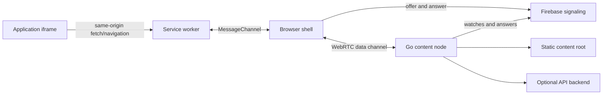

<p align="center">
  
</p>

# YuriRTC

YuriRTC delivers a web application over WebRTC data channels while presenting it to the application as ordinary same-origin HTTP traffic. A small static shell owns the peer connection, a service worker translates browser requests into framed messages, and a Go content node serves static files and an optional API backend over the resulting channel.

The repository contains the transport, signaling clients, content node, Firebase security templates, and the two-file static deployment. It does not contain a general-purpose HTTP reverse proxy or provider-specific edge configuration.

## Architecture



The browser shell remains loaded for the session so navigation inside the application does not destroy its `RTCPeerConnection`. The service worker is the transport boundary: it controls the application iframe, maps requests into the deployment's logical root, forwards them through the shell, and reconstructs browser `Response` objects. Protocol v3 keeps one interactive data channel and three asset channels; all four share one ICE/DTLS/SCTP connection. The asset lanes open before the application waterfall and retire after an idle period. Response bodies use adaptive consumption-driven credits, while request bodies stream from Fetch through the service worker and cross the RTC link only as the content node grants bounded upload credits.

The content node uses CUBIC congestion avoidance by default, requests Immediate-SACK during low-window recovery, and reduces the SCTP send path to one owned message copy plus bounded reusable packet buffers. Reno remains an explicit rollback setting. A new browser session opens one ordinary ICE route instead of doubling signaling and transfer work with speculative connections. If a selected UDP route later proves slow from real application goodput, the browser warms TCP in the background, moves new requests to it, lets existing requests and WebSockets drain on UDP, and then retires the predecessor. That short-lived route preference is reused across tabs and browser sessions. No application request is replayed during the handoff.

Static transfer optimizations remain protocol-v3 compatible. A capable loader privately negotiates gzip for eligible complete static responses; other responses remain byte-identical. Generic static files receive validators and conservative revalidation metadata, so arbitrary YuriRTC-hosted sites—not only EDUrocks path conventions—can reuse unchanged browser-cached bytes without caching APIs, partial responses, streams, or private responses. Browser image requests use the persistent bounded cache regardless of directory layout, while nested scripts, styles, fonts, and workers use validator-backed reuse. Large game payloads fetched by application code remain outside CacheStorage so games may own their OPFS strategy without storing a second copy.

Signaling has two independent Firebase legs:

- Firestore uses an unguessable document capability and short-lived records.
- Realtime Database uses an authenticated, per-user branch and a short-lived event stream.

The browser starts Firestore first and opens RTDB only after a bounded hedge delay or an immediate Firestore failure. Firestore polling is delayed and exponentially backed off; the RTDB anonymous identity and refresh token are reused instead of creating an account per attempt. Both legs send candidates once inside the completed SDP, and node cleanup is scheduled from signaling events rather than fixed-interval database scans. Firebase carries only signaling data; application payloads travel over WebRTC. The content node multiplexes peers over a fixed set of UDP and TCP ICE listeners instead of allocating a listening socket per user.

YuriRTC currently advertises direct UDP and TCP ICE candidates. It does not ship a TURN relay.

The carrier displays only a coarse classification of the route the browser selected: UDP or TCP, and port 443 or a configured non-443 port. It never puts the remote address, raw ICE candidate, or exact high/low fallback port in its DOM, public diagnostics, or application console. The peer address remains inherently available in browser-internal WebRTC diagnostics because this is a direct connection.

## Repository layout

| Path | Purpose |
| --- | --- |
| `packages/protocol` | Binary request/response framing and limits |
| `packages/signaling` | Firestore and RTDB signaling clients |
| `packages/loader` | Browser client, service worker, caching, scoping, and injection |
| `packages/integrity` | Signed immutable loader pointer published as `shaintloadingcheckpak` |
| `content-node` | Go WebRTC endpoint and content/API handler |
| `third_party/pion-sctp` | Reproducible Pion v1.11.1 transport fork with CUBIC and packet-path changes |
| `deploy/firebase` | Generic Firebase rules, indexes, and rule verification |
| `deploy/npm` | Source and generated `index.html`/`sw.js` static package |
| `docs` | Compatibility and deployment guidance |

## Requirements

- Node.js 22 or newer
- npm with workspace support
- Go 1.25 or newer
- A secure browser context (`https://`, or loopback during development)
- A Firebase project with Firestore, Realtime Database, and the required authentication provider enabled
- A publicly reachable content-node address and the selected UDP/TCP ports

## Build and test

Install exact JavaScript dependencies and run the complete self-hosted CI gate:

```bash
npm ci
npm run ci:local
```

The release-grade local E2E launches Chrome and exercises the real carrier,
service worker, loader bundle, Pion transport, static download path, and a
streaming upload through the Go API proxy. It runs both a fresh install and a
persisted previous-worker upgrade profile, and opens a second live tab
during an upload to verify first-carrier/standby election:

```bash
npm run test:e2e
```

The self-hosted gate runs both the signed-CDN and bundled-loader carriers in
Chromium, Firefox, and WebKit over both UDP and TCP. For an explicit local
cross-browser run:

```bash
node node_modules/playwright-core/cli.js install chromium firefox webkit
YURIRTC_BROWSER_E2E_ENGINES=chromium,firefox,webkit \
YURIRTC_BROWSER_E2E_PROTOCOLS=udp,tcp \
npm run test:e2e
```

`npm run ci:local` only builds, verifies, tests, and writes artifacts under
`build/ci`; it does not publish npm packages, upload carriers, or modify an
existing deployment.

Linux self-hosted runners can also exercise the real Go/WebRTC/SCTP path under
repeatable delay, random loss, burst loss, and reordering. The quick matrix is
the pull-request gate; the full matrix is intended for transport releases:

```bash
./content-node/wan-regression.sh --quick
./content-node/wan-regression.sh --full
```

The ordinary build may use non-deployable placeholder configuration so contributors can compile and test without access to a Firebase project. A public release requires explicit client configuration:

```bash
YURIRTC_FIREBASE_API_KEY="example-public-web-key" \
YURIRTC_FIREBASE_PROJECT_ID="example-project" \
YURIRTC_FIREBASE_DATABASE_URL="https://example-project-default-rtdb.example-region.firebasedatabase.app" \
npm run build:release

npm run verify:release
```

That command generates the normal pair at `deploy/npm/index.html` and
`deploy/npm/sw.js`, plus the CDN-independent variant under
`deploy/npm/bundled/`. The alternate HTML carries the exact current loader and
font inline; its same-version full `sw.js` and durable `client.js` remain
same-origin. Upload every file in that directory together. These are build
products; edit the readable files under `deploy/npm/src` instead. The
self-hosted CI script writes only under `build/ci` and never overwrites existing
deployment copies.

The release verifier checks the npm file list and generated artifacts. In particular, the loader package must not contain source maps, readable compiled JavaScript, or compiled tests. Public loader exports and CDN paths remain stable.

## Static hosting

The normal signed-CDN carrier requires two same-directory files:

```text
index.html
sw.js
```

The shell derives the worker URL and registration scope from its own URL. No bucket name or deployment prefix is compiled into it. It therefore supports origin-root hosting, a directory prefix, and path-style object URLs such as:

```text
https://storage.googleapis.com/example-bucket/index.html
https://s3.example-region.amazonaws.com/example-bucket/index.html
https://static.example.invalid/releases/stable/index.html
```

Serve `index.html` as `text/html` and `sw.js` as JavaScript. Both should use `Cache-Control: no-cache` so browsers revalidate releases. The shell fetches `shaintloadingcheckpak@latest/loader.json`, verifies its committed ECDSA P-256 signature, downloads the immutable `@advwebrec/grainloading@VERSION` client from jsDelivr or unpkg, verifies its SHA-256, and only then imports it. The signed client version is also passed to the same-origin worker stub so its worker import is immutable.

See [Deployment](docs/DEPLOYMENT.md) for Firebase setup, content-node configuration, publishing, object-store commands, and rollback. See [Compatibility](docs/COMPATIBILITY.md) before changing package names, environment variables, cache identifiers, signaling paths, or service-worker scope behavior.

## Obfuscation and ROT13 display text

Published browser JavaScript and the generated static shell are obfuscated. The shell stores visible page copy as ROT13 and renders it with the single font distributed by the loader package.

Obfuscation and ROT13 are packaging choices, not security boundaries. A browser must be able to execute the code and recover displayed text. Never embed service-account credentials, npm tokens, private keys, backend secrets, or authorization decisions in a browser artifact. Firebase web configuration is public by design; Firebase rules and backend authorization provide the protection.

## Security and compatibility

- Read [SECURITY.md](SECURITY.md) before reporting a vulnerability or operating a public node.
- Read [docs/COMPATIBILITY.md](docs/COMPATIBILITY.md) before upgrading an existing deployment.
- The content node accepts only protocol-v3 lanes; a peer speaking any other wire version is rejected at attach and cannot connect.
- Deploy Firebase rules before exposing the signaling configuration to clients.
- Treat the service worker as origin-wide authority within its registration scope.

## License

YuriRTC is free software, licensed under the [GNU Affero General Public License, version 3](LICENSE). If you run a modified version as a network service, section 13 requires you to offer its users the corresponding source. Third-party components and the bundled font retain their own license notices.
